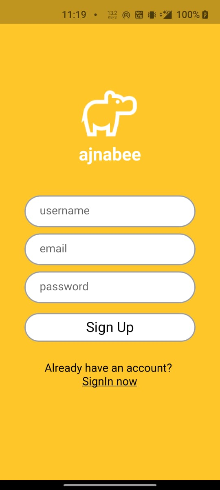
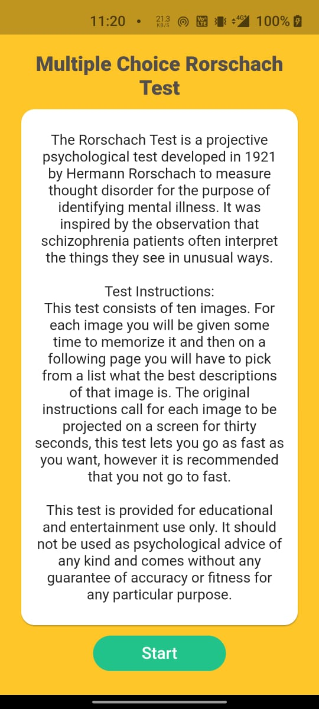

<h1 align="center">Ajnabee :hippopotamus:</h1>
<div align="center">
  <br>
  <h3> Meet people in a revolutionary way.</h3>
</div>

<div align="center">
  
[](https://flutter.dev/ "Flutter")
[](https://www.djangoproject.com/ "Django")
[](https://firebase.google.com/ "Firebase")
[](https://www.sqlite.org/index.html "SQLite")


</div>

---
 - Link to the YouTube video is : https://youtu.be/Pe04W-8gwPc .
 
 
- ### Snapshots of the project :

<div align="center">
  

  
  
  
  

</div>


---

  
### To run this project :

Clone the project -
```
  $ git clone https://github.com/Hungry-Hippoos/Ajnabee.git
```
  
- ### Start the server -
```
  $ cd Ajnabee/Ajnabee-server
 ``` 
Install all the reqirements -
```
  $ pip install -r requirements.txt
 ``` 
Run the following commands -

 for linux/mac :
``` 
  $ python manage.py migrate
  $ python manage.py makemigrations
``` 
 for windows :
 ``` 
  $ py manage.py migrate
  $ py manage.py makemigrations
 ``` 
Start the project -

 for linux/mac :
```
  $ python manage.py runserver
```  
 for windows :
``` 
  $ py manage.py runserver
```
 - ### Run the mobile application -
 ```
  $ cd ../../Ajnabee/Ajnabee-mobile
 ```
 To get the dependencies :
 ```
  $ flutter pub get
  ```
 To run the mobile application :
 ```
  $ flutter run
 ```
 
 ---
 ### If you want to clone the server or the mobile application individually -
 
 - Link to the server repository  <a href="https://github.com/Hungry-Hippoos/Ajnabee-server">:link:</a>
 - Link to the mobile applicaiton repository  <a href="https://github.com/Hungry-Hippoos/Ajnabee-mobile">:link:</a>
 

 #### Features to be added :
- Guide to help people start a conversation, keep a conversation alive, icebreakers.
- Video calling, voice calling features to be added.

---
- #### If you have any improvements create an issue and if you want you can also make a pull request for the same 

---
#### This project was built under 24 hours

---
<h3 align="center"><b>Developed with :heart: by <a href="https://github.com/mrpandya">Manan Pandya</a>, <a href="https://github.com/tusharsarkar3">Tushar Sarkar</a>, <a href="https://github.com/dhairya903">Dhairya Shah</a>, <a href="https://github.com/sanjeetnaik">Sanjeet Naik</a>.</b></h1>
